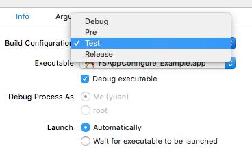
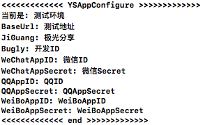

# YSAppConfigure

> 自己YY设计的一个App环境配置模块，比较简单，供参考交流

## Contents

* YSAppConfigure.h
* configure.plist

## How do you use it?

1. 拖入YSAppConfigure文件夹到你的工程中
2. 不需要通过任何操作，因为内部是通过load加载
3. 通过 YSAppConfigure.h 查看API，通过类方法调用
4. 通过 切换Scheme实现不同配置

### 设置不同的App名称，方便调试

### 输出相应环境的日志，方便开发人员确认

### 🎉看到这里恭喜你，可以愉快的切换环境了

## API
*   ✅BaseUrl
*   ✅JiGuang
*   ✅Bugly
*   ✅WeChatAppID
*   ✅WeChatAppSecret
*   ✅QQAppID
*   ✅QQAppSecret
*   ✅WeiBoAppID
*   ✅WeiBoAppSecret
*   ✅currentType
*   ✅其他可以根据需要自定义，修改相关逻辑代码

## 总结

以上均是开发过程的积累，学到哪记到哪

原创文章，转载请注明出处，谢谢！
